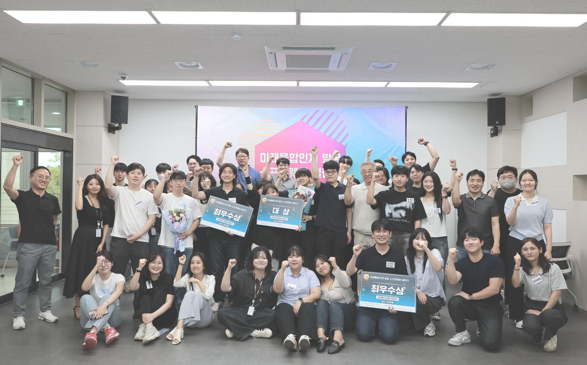

  

 The profile of ENFYCIUS

:wave: Hello, I'm JongHyeok Kim, and I majored in Civil and Environmental Engineering at Hanbat National University in South Korea. I am excited to share that I have recently been accepted into the Master's program at [Gwangju Institute of Science and Technology (GIST)'s School of Mechanical and Robotics Engineering (MRE)](./assets/images/gist/gist.png). I will be conducting my research under the guidance of Professor Hyunseok Oh in his lab.

I am incredibly grateful and excited to have the opportunity to become a graduate student at GIST. Although my cousin, who is currently working as a senior researcher at Korea Institute of Science and Technology Information (KISTI), pursued a different field in Computer Science, I am honored to follow a similar academic path at GIST. You can find his research work on [Google Scholar](https://scholar.google.com/citations?user=aW7jSykAAAAJ&hl=ko) and [ResearchGate](https://www.researchgate.net/profile/Ju-Won-Park).

Additionally, I am thrilled to announce that I have also been accepted as a government scholarship recipient for the Master's program in Robotics and Mechatronics Engineering at Daegu Gyeongbuk Institute of Science and Technology (DGIST). This recent achievement adds to my excitement as I look forward to the next chapter of my academic journey.

I've been researching deep learning at the ConstructionIT lab and previously researched it at the Department of Basic Science, Hanbat National University.

Especially, based on deep learning, in the former lab, we'd been conducting research to detect extent of damage to the mooring facility until early 2023. As well as, as part of that research, I developed a ROS-based construction robot to perform such tasks in 2022. In the latter lab, an inverse problem, in science, is the process of calculating from a set of observations the causal factors that produced them, was selected as the topic of our research and we were studying it using **Deep Neural Network (DNN)** for about a year and a half. Even though it didn't result in any tangible breakthroughs, it was a rare glimpse into the intersection of artificial intelligence and math.

Previously, I conducted various research in the fields of ConstructionIT, ROS-based robotics, sensor fusion, and the integration of computer vision and artificial intelligence. Additionally, I participated in programs such as ‘소중한 봉사단’ and ‘Herald’ at Hanbat National University to further enhance my skills. I also taught Python, Android, machine learning, and deep learning to 17 students.

> Teaching is the beginning of **enlightenment** !

> Also, I see teaching as another learning opportunity and a chance to be at the forefront of education.

Now that these activities have come to an end, I am focusing on leveraging these experiences to plan new research and projects for the future.

These days I'm hosting a live broadcast on [my YouTube channel](https://youtube.com/@enfycius0131?feature=shared) titled "스터디윗미(Study with me)(Civil Engineering & Mathematics & Coding)". Alongside my academic pursuits, I've also taken up golf recently, which has become a great way for me to relax and challenge myself outside of the lab. If you're curious, you can check out one of my golf videos here: [Watch my golf video](https://www.youtube.com/watch?v=7sSYykzI_kU)

---

### :whale2: My First Job, LabIS

> I worked at LabIS as a back-end and AI developer.

> During my time there, we developed an AI model that converted text into 3D and also worked on a 2D AI model that modified webtoon images.

---

### :rose: Our Journey at *The Herald*

> I love these members. I sincerely hope that they will continue to strive in various fields and reach their dreams.

---

### :guardsman: We are the Guardians Team

We are the Guardians Team that help each other out, collaborate, and move forward.

Our journey has just begun, and with every step we take, we want to enrich the past and prepare for the future.

Being composed of different majors allows us to look at what we are trying to do from different perspectives, which we believe will play to our strengths.

> Sungji Lee: 😊 I’m so lucky to have an older brother who always supports me and guides me on the right path. Let’s make a lot of money and succeed together! 💪

> Jongyeol Na: The best output of Hanbat National University, God Jongyeol 👑. A true hidden master who got accepted into the highly renowned AI graduate program at DGIST. Thank you for always looking out for me! 🙏

> Minjoong Kim: 📝 He has the outstanding class of someone who’s published SCIE papers. With top-level creativity that others can’t even imagine, he’s truly one of a kind. 🎓 Thanks for everything 🎉

---

### 💡 Tip

If you're having trouble solving the problem, try the following, as I did.

Originally, I used to take a walk when I had problems that were not solved or blocked, but recently, I have often driven with [my recently purchased car](./assets/images/my_car/)

> Taking a walk is the best solution for a healthy body and a healthy mind.

> Driving with the windows open will bring you back to a clear mind with fresh air!

---

### 🧘 Faith

I've always been fascinated by the idea of pioneering a field by oneself, without anyone else's help. If I had to pick one trait that is most important to me, I would say it is capacity of staying the flow.

From the moment we are born with a brain, I think that the most important activity of being human is using it.

I basically enjoy interacting with people, and the pleasure I get from that is immeasurable.

---

### :fountain: Acknowledgements

> Getting the opportunity to learn from a Guru in a field is one of the greatest joys and blessings in life.

First of all, I would like to express my sincere gratitude to Professor [Jaemin Shin](https://sites.google.com/site/jaeminshin3/), who laid the foundation for all my learning.

> Recently, my esteemed professor gave me a delicious box of chocolates to celebrate my admission to GIST graduate school, and I am truly grateful for this thoughtful gift.

Next, I would like to express my sincere gratitude to my professors in the Department of Civil Engineering at Hanbat National University for their encouragement and assistance in helping me learn Civil Engineering smoothly.

I would also like to express my sincere gratitude to Prof. [Jongseok Lee](http://cafe.hanbat.ac.kr/cafe/19961001/) for always believing in, supporting me and caring about me. 

Furthermore, I would like to thank Professor [Taehwa Jung](https://sites.google.com/site/taehwajung/) for not only recognizing my potential and providing me with opportunities, such as arranging an internships at Korea University during the winter vacation, but also for always reminding me of the truth of learning.

Finally, in particular, I would like to express my deepest appreciation to Prof. [Haemin Jeon](https://haeminjeon.wixsite.com/hbnu), whose mentorship and guidance have been a cornerstone of my career. *Would I be where I am today if I had not met her?* She is, without question, one of the most generous and influential people I have ever had the privilege to know. I aspire to give to others as much as she has given to me, and for that, I will be eternally grateful.

This is the place where my dreams, future, and aspirations align.

---

### :newspaper_roll: Announcements

I graduated from Hanbat National University on February 16, 2024, with a degree in Civil and Environmental Engineering, *summa cum laude*.

> My school life at Hanbat National University has been enjoyable throughout, and I have learned a lot of different things, which are my most precious memories.

> Photo with my friends from *The Herald*, the English-language newspaper at Hanbat National University.

> Photo with Myeong-gyu Kim, a reporter for *The Herald*, the English-language newspaper of Hanbat National University.

---

At the graduation ceremony, I received a diploma from the president of Hanbat National University as a representative of the Department of Civil and Environmental Engineering on February 16, 2024. I also received the Academic Excellence Award for graduating *summa cum laude* **(Rank: 1 / 87)** from the Department of Civil and Environmental Engineering at Hanbat National University.

---

We received the Grand Prize (Institute of Information & Communications Technology Planning & Evaluation (IITP) President's Award) at the Future Convergence Talent Discovery Software Challenge, hosted by Gyeongsan Innovation Academy, on my birthday, July 11.

> Our team name is "Friends on the Road," and we submitted our project titled "Is the Way Ahead Safe? StepGuard."

> Thank you so much to my friends who worked hard alongside me.

> I gathered a team with friends I know who are either currently studying at or have graduated from various universities (Hanbat National University, Jeonbuk National University, and Wonkwang University).

---

I am currently interning at the SDDO Lab at GIST, where I plan to focus my research primarily on Prognostics and Health Management (PHM). The project assigned to me is a government-related research project focused on nuclear power, and it is likely that I will continue this work even after advancing to my Ph.D.

---

I was fortunate to be able to attend the lab’s Homecoming Day during my internship.

It was a precious and invaluable experience for me, and I also felt a hopeful assurance that, with dedicated effort, I could achieve similar success, thanks to the inspiring paths paved by such accomplished seniors. Their presence motivated me deeply, and I am determined to strive toward becoming someone as admirable as they are.

---

During my internship, I was fortunate to attend the lab’s year-end party.
Prior to the party, we held a Secret Santa event, and I was able to guess who had given me my gift based on the thoughtful choice.
The gift turned out to be an Apple polishing cloth—something I had been wanting for a long time but hesitated to purchase due to its price.
To my great surprise, the senior who played the role of my Secret Santa seemed to understand my unspoken wish, just like a real Santa Claus, and prepared the perfect gift for me.
I couldn’t have been happier to discover that this was my gift.

As I correctly guessed who my Secret Santa was, the professor rewarded me with a Starbucks coupon.
Additionally, the professor generously gave each of us another Starbucks coupon as a separate gift for the lab members.

One particularly memorable moment during the year-end party was when we gathered at a café after the main dinner to reflect on the year.
Taking turns, each of us shared our thoughts and experiences.
I expressed how grateful and joyful I felt to have been part of the SDDO lab this year.
Thanks to the warm support of the professor and the wonderful lab members, the SDDO lab felt like a cozy haven, even during the cold winter season.

---

From January 22 to 23, our lab had the privilege of hosting a **Joint Workshop** with the KAIST iAI Lab.  

This collaborative event provided an invaluable opportunity for the exchange of innovative ideas, fostering mutual growth and synergy between the two leading research institutions.

The workshop featured thought-provoking presentations, engaging discussions, and a shared vision for advancing research in AI and Prognostics and Health Management (PHM).

We deeply appreciated the insights and camaraderie shared during these two days, and we hope this marks the beginning of many fruitful collaborations between GIST and KAIST.

Below is a group photo capturing the spirit of our meaningful time together:

During the workshop, we also took the opportunity to capture a special moment with just our **SDDO Lab members**.  

This photo reflects the strong bond and teamwork that drives our research forward. It is a reminder of the collaborative spirit within our lab, which inspires us to continue pursuing innovative solutions in our respective fields.

Here’s the SDDO Lab family:

---

From February 11, 2025, our lab had the privilege of attending the KSME 2025 Scientific Machine Learning Workshop held at the Posco Center in Seoul.

This workshop was hosted by our professor, Prof. Hyunseok Oh, and organized by the Korean Society of Mechanical Engineers (KSME). It served as a platform for researchers and practitioners to exchange insights on physics-informed and knowledge-based AI approaches in mechanical engineering.

As SDDO Lab members, we actively participated in the sessions, gaining valuable perspectives on the future directions of scientific machine learning and its applications in Prognostics and Health Management (PHM).

Here’s a photo from the workshop that captures this meaningful experience:

---

From May 15, 2025, we celebrated Teachers’ Day at the SDDO Lab.

On this meaningful day, we expressed our gratitude to our professor, Prof. Hyunseok Oh, by presenting a bouquet of flowers. It was a small gesture, but it carried our sincere appreciation for his continuous guidance, encouragement, and dedication to nurturing us as researchers.

The moment was both heartwarming and memorable, reminding us of the importance of mentorship in our academic journey. Teachers’ Day served as an opportunity to reflect on how fortunate we are to learn and grow under the leadership of such an inspiring mentor.

Here is a photo from that special occasion:

On this special day, we were also honored to welcome Dr. Chungeon Kim and Master Jungsik Choi, who visited our lab to celebrate Teacher’s Day together.

Their presence made the occasion even more meaningful, as we were able to share warm moments of gratitude and camaraderie beyond our daily research activities. It was a reminder that the SDDO Lab is not only a place for academic pursuit, but also a true community where relationships and mentorship flourish.

Here’s the group photo capturing this memorable gathering:

---

From June 2025, I am honored to share that I have been selected as a recipient of the Graduate Presidential Science Scholarship (대학원 대통령과학장학금), awarded by the Korea Student Aid Foundation (한국장학재단).

This prestigious scholarship recognizes graduate students in science and engineering across Korea who have demonstrated academic excellence and research potential. It is both a personal milestone and a meaningful encouragement to further contribute to the field of AI and Prognostics and Health Management (PHM).

This announcement comes just a few months after our Joint Workshop with the KAIST iAI Lab, where collaboration and shared vision took center stage. The energy and synergy exchanged during that event reaffirmed the importance of growing not only as an individual researcher, but also as part of a community striving toward impactful innovation.

I am sincerely grateful to my advisor, lab members, and colleagues for their unwavering support and belief in my journey.

This achievement is not the end but a stronger beginning — one that motivates me to continue pushing the boundaries of research, especially in PHM, AI-driven diagnostics, and intelligent systems.

Here’s to collective growth, and to the many challenges ahead that I now face with even greater purpose and determination.

Featured on the official GIST website, highlighting my award of the Graduate Presidential Science Scholarship (대학원 대통령과학장학금).

Posted on [the alumni page of Hanbat National University](https://www.hanbat.ac.kr/prog/bbsArticle/BBSMSTR_000000000055/view.do?nttId=B000000156554Os8qY3f), where I shared words of encouragement for younger students after receiving the scholarship.

---

From June 23 to 25, 2025, our SDDO Lab members had the honor of attending the PHM Korea 2025 Conference, held at the Booyoung Hotel in Jeju, Korea.

This annual conference brought together leading experts, researchers, and practitioners in the field of Prognostics and Health Management (PHM) to exchange cutting-edge ideas and foster collaboration.

During this event, I had the privilege of delivering a presentation titled:

“Towards Open-Set Fault Diagnosis under Undefined Fault Modes.”

In my talk, I shared our lab’s latest research on applying open-set recognition (OSR) techniques to fault diagnosis problems, addressing the challenge of detecting previously undefined fault modes in complex engineering systems. This work highlights how AI-driven approaches can improve the reliability and safety of critical infrastructures, such as nuclear power plants, by moving beyond traditional closed-set assumptions.

The conference provided an invaluable opportunity not only to present our findings but also to engage with scholars and industry experts, receiving insightful feedback that will guide future directions of our work.

Here’s a photo capturing the memorable experience from PHM Korea 2025:

---

From August 2025, I had the privilege of attending the KSME Mechanical AI Expert Symposium (기계인공지능 전문가 심포지엄), hosted by the Mechanical AI Research Group of the Korean Society of Mechanical Engineers (KSME).

The symposium focused on two pivotal themes shaping the future of mechanical engineering and AI: Large Language Models (LLMs) and Physics-Informed Machine Learning (PIML). It was an inspiring opportunity to hear from leading experts at the forefront of integrating AI with mechanical engineering, and to reflect on the transformative impact of these technologies on both academia and industry.

Beyond attending the sessions, I was also honored to contribute in another meaningful way:
As a member of the SDDO Lab, I have been responsible for designing the posters used for our lab’s academic and external events. For this symposium as well, I created the official poster, which represented both our lab’s creative spirit and its dedication to communicating research in a professional and impactful manner.

Here is the symposium poster that I designed, which also serves as a reminder of this special occasion:

---

From September 2025, our SDDO Lab members came together for a memorable MT (Membership Training) trip to **Gosapo Beach**.

After months of intense research and academic activities, this retreat provided us with a chance to set aside the challenges of our work for a while and simply refresh ourselves in each other's company. Surrounded by the ocean and nature, we enjoyed a much-needed moment of relaxation that reminded us of the importance of balance in our journey as researchers.

One highlight of the trip was capturing a group photo at the pension overlooking the sea, a scene that perfectly reflected both the calm beauty of Gosapo Beach and the warm, family-like spirit of our SDDO Lab.

Here's the photo that will remain as a special memory of our time together:

---

On November 4th, I had the opportunity to return to Hanbat National University as an invited speaker, not as a student, but as a graduate researcher from GIST. During this 50-minute talk, I introduced my academic journey, including how I joined Gwangju Institute of Science and Technology (GIST) as a master’s course student and how I later received the Presidential Science Scholarship. I mainly shared the past research experiences that shaped my current research direction, and explained how continuous involvement in real projects eventually led me to advanced graduate-level research. Rather than focusing on competition or comparison, my goal in this lecture was to show students that stable growth in research ability naturally opens new academic doors, as long as one keeps learning and improving with consistency.

---

From December 7th to 12th, I attended PHM-AP 2025, an international conference held in Singapore, where researchers from academia and industry gathered to discuss recent advances in Prognostics and Health Management (PHM). During the conference, I had the opportunity to present our research, sharing our approach and findings with an international audience. Presenting at PHM-AP allowed me to receive valuable feedback from experts working on related problems and to reflect on how my current work fits into the broader PHM research landscape. Beyond the presentation itself, the conference experience reaffirmed the importance of continuously refining research ideas through discussion, critique, and exposure to diverse perspectives.

Outside the conference sessions, I also had time to experience Singapore more personally. One memorable moment was visiting the Singapore Botanic Gardens together with Jeongmin Oh, a Ph.D. candidate and the senior lab member (lab lead) in our research group. Walking through the gardens provided a brief but meaningful break from the intensive academic schedule, and it was a chance to have informal conversations about research, graduate life, and future directions. These moments outside the conference venue often become just as meaningful as the sessions themselves, reminding me that research is shaped not only by experiments and papers, but also by shared experiences and discussions with colleagues.

---

My tutee, **Daniel Son**, lives in Southern California, USA, and his sister is also taking my class, officially started working as an Android app developer at OwnLab since January 22, 2024.

> I sincerely hope it's a good experience for you.

My tutee, **Taewan Ko** officially started working as an Android app developer at OwnLab since November 8, 2023.

> I sincerely hope it's a good experience for you.

Congratulations! My tutee-**Taewan Ko** and **Junhee Kim** won the bronze award in [Korea Code Fair Competitions](https://kcf.or.kr/notice/?uid=6046&mod=document).

> Your hard work has paid off. Keep up the good work to get into the high school of your choice!

---

### :memo: References

#### :books: [CV](https://drive.google.com/file/d/1qdNqciJHsRwNTLXbAya1vh-_fknnwFl0/view?usp=share_link)

#### 🎓 [Google Scholar](https://scholar.google.com/citations?user=6lUHV9sAAAAJ&hl=ko)

---

### :blush: Teaching & Advising

**Seoyoon Lee**, **Yujoon Han**, **Youngwoo Seo**, **Taewan Ko**, **Yeonwoo Joo**, **Jihan Lim**, **Daan Yu**, **Yerin Lee**, **Wooju Lee**, **Daniel Son**, **Abigail Son**, **Heewoo Kim**, **Wonje Lee**, **Yunseo Lee**, **Myungsoo Kim**, **Sungeun Jeon**, **Giyeon Kim**, **Ryeowon Lee**

---

### :runner: Career

|        Date       |         Type        |                      Contents                     |                  Organization                  |
|:-----------------:|:-------------------:|:-------------------------------------------------:|:----------------------------------------------:|
|     2020.03 ~ 2024.02    |      Education (B.S.)      | Department of Civil and Environmental Engineering | Hanbat National University (HBNU) [1](#1) |
|     2025.03 ~ 2027.02 (Expected)    |      Education (M.S.)      | School of Mechanical and Robotics Engineering | [Gwangju Institute of Science and Technology (GIST)](./assets/images/gist/gist.png) [2](#2) |
| 2014.03 ~ 2017.03 |   Gifted Education  |                    Certificated                   | Educational Research and Information Institute |
|     2015.11.25    |        Award        |                     Gold Prize                    | Educational Research and Information Institute |
|     2021.12.10    |        Award        |                  President's Award                |           Hanbat National University           |
|     2021.12.20    |        Award        |                 Encouragement Prize               |           Hanbat National University           |
| 2022.06.28 ~ 2022.08.18 |        Award        |           [Encouragement Prize](./assets/images/LH.png)               |         Korea Land&Housing Corporation         |
|     2022.11.25    |        Award        |                  Excellence Prize                 |           Hanbat National University           |
|     2022.11.25    |        Award        |                  Excellence Prize                 |           Hanbat National University           |
|     2024.02.16    |        Award        |                  Academic Excellence Award                 |           Hanbat National University           |
| 2024.06.23 ~ 2024.07.11 |     Award     |     Grand Prize (Institute of Information & Communications Technology Planning & Evaluation (IITP) President's Award)    | Gyeongsan Innovation Academy |
| 2021.06.23 ~ 2021.09.09 |     Competition     |      Open Source Software Developer Competition   | [Open Source Software Support Center](https://www.oss.kr/) |
| 2021.10.25 ~ 2023.12.21 |     Competition     |      Data Analytics Competition 2021   | Hanbat National University |
| 2021.12 |     Competition     |      Capstone Design Competition 2021   | Hanbat National University |
| 2022.06 ~ 2022.08 |     Competition     |      The 13th National Land Development Technology Competition   | Korea Land&Housing Corporation |
| 2022.11 |     Competition     |      Capstone Design Competition 2022   | Hanbat National University |
| 2023.05.19 ~ 2023.05.21 |     Competition     |      Glitch Hackathon   | Trinity |
| 2023.07 ~ 2023.09 |     Competition     |      The 14th National Land Development Technology Competition   | Korea Land&Housing Corporation |
| 2023.10.04 ~ 2023.11.22 |     Competition     |      [Data Analytics Competition 2023](https://github.com/enfycius/Miri-Su/blob/main/assets/pdfs/Flood%20Guardians%20%EB%B9%85%EB%8D%B0%EC%9D%B4%ED%84%B0%20%EA%B2%BD%EC%A7%84%EB%8C%80%ED%9A%8C%20%EB%B0%9C%ED%91%9C%EC%9E%90%EB%A3%8C_v9.pdf)   | Hanbat National University |
| 2024.06.23 ~ 2024.07.11 |     Competition     |     Future Convergence Talent Discovery Software Challenge   | Gyeongsan Innovation Academy |
| 2025.06           |     Scholarship      |     Graduate Presidential Science Scholarship (대학원 대통령과학장학금)     | Korea Student Aid Foundation (한국장학재단) |
|  2021.10 ~ 2022.09.10   |         Club        | Vice-chairman, [import(Coding Club)](https://import-hanbat.com/) |           Hanbat National University          |
|      2023.03 ~ 2023.10     |         Club        | AI Developer, [Miracle](https://www.instagram.com/team_miracle_hbnu/) |           Hanbat National University          |
|  2023.03 ~ 2024.02   | On-Campus Activities | [소중한 봉사단 2기](http://www.ccnnews.co.kr/news/articleView.html?idxno=288342) |           Hanbat National University          |
|  2023.03 ~ 2024.01   | On-Campus Activities | [Cub Reporter](/assets/images/herald/) |           [Hanbat Herald]((https://www.hanbat.ac.kr/news/index.do)), Hanbat National University          |
|      2017.09      | External Activities |     Institute for Higher Education Innovation     |                Yonsei University               |
| 2020.05 ~ 2020.12 | External Activities |                     Translator                    |                    JavaTPoint                  |
|     2022.05 ~      | External Activities |     One Week One Blog Post     |                Non-Profit Organization               |
| 2023.07.24 ~ 2023.08.31 | External Activities | [Hana Power on Challenge](./assets/images/hana_univ/) | [Hana Financial Group](https://www.hanapoweron.com/) |
|     2014.01.31 ~  |   Team Activities   |                 Leader, YouHyeok Team             |                       N/A                      |
|     2019.11 ~     |   Team Activities   |                 Hacker, MOKA Team                 |             Sungkyunkwan University            |
| 2019.12 ~ 2021.07 |   Team Activities   |                 Leader, PSG Team                  |                       N/A                      |
|     2022.01 ~     |   Team Activities   |                 Leader, Project Team              |                       N/A                      |
| 2020.10 ~ 2021.02 |   Team Activities   |               Leader, APPSILON Team               |                       N/A                      |
|     2021.02 ~ 2024.01    |   Team Activities   | Researcher, [Dropper Lab](https://dropper.tech)   |                    Halliance                   |
| 2021.02 ~ 2021.07 |   Team Activities   |               App Developer, 과제 다했니             |                    과제 다했니                    |
|     2022.01 ~ 2024.08    |   Start-up, Club    |                    OwnLab, CTO                  | Hanbat National University Start-up Support Foundation[3](#3), [KOSME](https://start.kosmes.or.kr/yh_mai001_001.do) |
| 2022.01 ~ 2023.12 |       Start-up      |                  Developer, [LABis](https://www.saramin.co.kr/zf_user/company-info/view?csn=eWUwRXJzSm02Sm5OMUZISDFNbXVsQT09)                 | UNIST[4](#4), [KOSME](https://start.kosmes.or.kr/yh_mai001_001.do) |
|     2024.03 ~ 2024.08    |       Start-up, Club      |                  Developer, [Integrity](./assets/pdf/hanyang.pdf)                 | Hanyang University ERICA[#5](#5) |
| 2023.03 |   Work Experience   |                  Lecturer (C, Python, SQL)                 | [Hyosung Computer Academy](https://comgopa.co.kr/)[6](#6) |
|     2023.03 ~ 2024.08    |   Work Experience   |                  Lecturer (C, Python, C++, Java) (₩ 15K ~ 30K per Hour)                 | N/A |
| 2018.08 ~ 2018.09 |       Project       | The Recycle Project (Haesung High School Notice App) |      Jeonju Haesung High School          |
| 2020.05 ~ 2021.07 |       Project       | The Stellar Project (One Commit per Day)     |                    PSG Team                    |
|     2021.01 ~     |       Project       | The Demeter Project (EZEN Const Web Site)    |           Ezen Construction Company            |
| 2021.01 ~ 2021.07 |       Project       | The Booung Project (PSG Notification Service)|                    PSG Team                    |
| 2021.01 ~ 2021.05 |       Project       | The Zilot Project (Github Generalization)    |                    PSG Team                    |
| 2021.02 ~ 2021.07 |       Project       | The Pilot Project (PSG Kakao Chatbot)        |                    PSG Team                    |
|     2022.01 ~     |       Project       | The Hyades Project (PSG Platform(Such as Notion)) |               PSG Team                    |
|     2022.02 ~     |       Project       | The petBook Project (Animal Info)            |                    PSG Team                    |
| 2021.02 ~ 2021.07 |       Project       | The Semyorka Project (YouHyeok Official Website)|                 YouHyeok                    | 
|     2021.07 ~     |       Project       | The Nemesis Project                          |                       N/A                      |
|     2022.02 ~     |       Project       | The Zeus Project                             |                       N/A                      |
| 2021.07 ~ 2023.01 |       Project       | The Ulixes Project (Photo Editing Software for Image Augmentation)  | Construction Information Technology Lab, Hanbat Nat'l Univ. |
| 2021.03 ~ 2021.07 |       Project       | The Pigbar Donut Project (Information)       |                    과제 다했니                    |
|     2023.03       |       Project       | Development of Instructor Management System (Based on Spring Boot, EgovFramework, MariaDB) (₩ 4,000K ~ 7,000K per one copy)       |                    LABis                    |
|     2023.05       |       Project       | Development of a Shopping Malls  (Based on ReactJS, Typescript) (₩ 100K ~ 150K per one copy)       |                    LABis                    |
| 2023.06 ~ 2023.12 |       Project       | Development of a Text to 3D Rendering System  (Based on PyTorch3D) (Confidential)       |                    LABis                    |
| 2023.10 ~ 2024.01 |       Project       | Development of an OwnLab MVP Model  (Developing with separate technology stacks) (₩ 6,600K ~ 7,200K)       |                    OwnLab                    |
| 2021.07 ~ 2021.08 | Offline Internships | Image Classification with Toy Sets     | Construction Information Technology Lab, Hanbat Nat'l Univ.[7](#7) |
| 2023.01.27 ~ 2023.02.20 | [Offline Internships](./assets/images/internships/KU/) | Analysis of the Extended Boussinesq Equations | [Coastal Hydrodynamics Laboratory (CHL), Korea Univ.](http://coastal.korea.ac.kr/)[8](#8) |
| 2024.10.24 ~ | [Offline Internships](./assets/images/internships/GIST/SDDO.png) | Prognostics and Health Management (PHM) | [Smart Diagnosis and Design Optimization Laboratory (SDDOL), GIST](https://sddo.gist.ac.kr/index.php)[9](#9) |
| 2021.02 ~ 2022.08 | Research Activities | Resolving an Inverse Problem based on Deep Neural Networks | Mathematical Sciences Lab, Hanbat Nat'l Univ. |
| 2021.08 ~ 2021.12 | Research Activities | Image Processing based on Deep Neural Networks for Detecting a Fender | Construction Information Technology Lab, Hanbat Nat'l Univ.[7](#7) |
| 2021.12 ~ 2023.01 | Research Activities | Real-time Fenders Detection and Mapping System using Streo Vision and GPS | Construction Information Technology Lab, Hanbat Nat'l Univ.[7](#7) |
| 2021.06 ~ 2023.01 | Research Activities | Object Detection for Multiple Types of Fenders | Construction Information Technology Lab, Hanbat Nat'l Univ.[7](#7) |
| 2022.06 ~ 2023.01 | Research Activities | Laboratory Leader | Construction Information Technology Lab, Hanbat Nat'l Univ.[7](#7) |
|     2023.01 ~ 2024.02    | Research Activities | Supporter, Developer | Hydraulic and Ecology-Environment Lab, Hanbat Nat'l Univ.[10](#10) |
| 2022.04 | Papers | [Development of Fender Segmentation System for Port Structures using Vision Sensor and Deep Learning](http://journal.auric.kr/jksmi/ArticleDetail/CMAG/244042) | Journal of the Korea Institute for Structural Maintenance and Inspection[11](#11) |
| 2023.12 | Papers | [Analysis of Piezoresistive Properties of Cement Composites with Fly Ash and Carbon Nanotubes Using Transformer Algorithm](https://www.jcoseik.or.kr/articles/article/0L17/) | Journal of the Computational Structural Engineering Institute of Korea[12](#12) |
| 2022.11 | [Posters](https://www.coseik.or.kr/boards/notice/28995/detail/news/notice/)[13](#13) | [Development of a Construction Robot for Evaluation of Assembly Performance of Modular Steel Structures](./assets/images/poster.JPG) | Journal of the Computational Structural Engineering Institute of Korea[12](#12) |
| 2021.03.22 ~ 2021.06.17 | Extracurricular Activities | Math Assistant | Nomad College, Hanbat Nat'l Univ. |  

> <a id="1">[1]</a> 125, Dongseo-daero, Yuseong-gu, Daejeon, Republic of Korea

> <a id="2">[2]</a> 123, Cheomdangwagi-ro, Buk-gu, Gwangju, Republic of Korea

> <a id="3">[3]</a> Room 608, S5, 125, Dongseo-daero, Yuseong-gu, Daejeon, 34158, Republic of Korea

> <a id="4">[4]</a> 50, UNIST-gil, Eonyang-eup, Ulju-gun, Ulsan, Republic of Korea

> <a id="5">[5]</a> 55, Hanyangdaehak-ro, Sangnok-gu, Ansan-si, Gyeonggi-do, Republic of Korea

> <a id="6">[6]</a> 5F, 134, Dunsan-ro, Seo-gu, Daejeon, Republic of Korea

> <a id="7">[7]</a> Room 218, S8, 125, Dongseo-daero, Yuseong-gu, Daejeon, 34158, Republic of Korea

> <a id="8">[8]</a> Eng. Bldg. Rm. 233, 73-15, Anam-ro, Seongbuk-gu, Seoul, Republic of Korea

> <a id="9">[9]</a> Room 317-318, School of Mechanical and Robotics Engineering (S1), 123, Cheomdangwagi-ro, Buk-gu, Gwangju, Republic of Korea

> <a id="10">[10]</a> Room 217, S8, 125, Dongseo-daero, Yuseong-gu, Daejeon, 34158, Republic of Korea

> <a id="11">[11]</a> Room 505, 15, Beobwon-ro 2-gil, Seocho-gu, Seoul, Republic of Korea

> <a id="12">[12]</a> Room 808, Building 1 of the Korea Science and Technology Center, 22, Teheran-ro 7-gil, Gangnam-gu, Seoul

> <a id="13">[13]</a> Tower B. B1F, 1153, Misiryeongyet-gil, Toseong-myeon, Goseong-gun, Gangwon-do, Republic of Korea

---

### :rainbow: Works

- [Haesung Notice App](https://play.google.com/store/apps/details?id=com.jhspt.recycleproj "Recycle Project")
- [PSG Website](http://psg.or.kr/ "Stellar Project")
- [Import Hanbat Website](https://import-hanbat.com/ "Import Hanbat")
- [The Zeus Project](https://ezenconst.co.kr/ "The Zeus Project")
- [LH](https://www.youtube.com/watch?v=uSh5G17O6fE "A Construction Robot for Evaluation of Assembly Performance of Modular Steel Structures")

---

### :paperclip: Publications

#### 🌍 SCIE Publications

* Oh, J.1, **Kim, J.1**, & Oh, H.1* (2025). [Enhanced Fault Diagnosis of Reactor Coolant Pumps Using Multi-Modal Vibration Features and Open-Set Recognition Technique.](#) *Journal TBD*.   

> 1 Department of Mechanical Engineering, Gwangju Institute of Science and Technology (GIST), Republic of Korea  

> * Corresponding author: hsoh@gist.ac.kr  

* Lee, D.1, **Kim, J.1**, Choi, M.1, Park, C.2, Kim, C. W.2, & Oh, H.1* (2025). *[Title TBD].* *Journal TBD*.   

> 1 Department of Mechanical Engineering, Gwangju Institute of Science and Technology (GIST), 123 Cheomdangwagi-ro, Buk-gu, Gwangju 61005, Republic of Korea  
> 2 Department of Mechanical Engineering, Konkuk University, 120 Neungdong-ro, Gwangjin-gu, Seoul 05029, Republic of Korea  

> * Corresponding author: hsoh@gist.ac.kr  

* **Yang, S.**1†, **Jang, D.**2†, Kim, J.3, & Jeon, H.4* (2025). [Autonomous Concrete Crack Monitoring using a Mobile Robot with 2-DoF Manipulator and Stereo Vision Sensors.](#) *Sensors* (MDPI). 

> 1 Department of Civil and Environmental Engineering, Hanbat National University, Republic of Korea  
> 2 Department of Civil Engineering, University of Texas at Arlington, USA  
> 3 Department of Mechanical and Robotics Engineering, Gwangju Institute of Science and Technology (GIST), Republic of Korea  
> 4 Department of Civil and Environmental Engineering, Hanbat National University, Republic of Korea  

> † These authors contributed equally to this work  
> * Corresponding author: haemin.jeon@gmail.com

* Hwang, M.a,1, **Kim, J.**a,1, Lee, H.a, & Oh, H.a,\* (2025). [Scale-Free and Phase-Agnostic Detection of Interturn Short Circuit Faults in Permanent Magnet Synchronous Motors](https://ieeexplore.ieee.org/document/11146749). *IEEE Access*. 

> a Department of Mechanical and Robotics Engineering, Gwangju Institute of Science and Technology, Gwangju 61005, Republic of Korea  

> 1 These authors contributed equally to this work.
  
> \* Corresponding author: Hyunseok Oh (hsoh@gist.ac.kr) 

* Jang, D.a,1, Park, J.b,1, Choi, S.b, Bang, J.c, Choi, J.c, **Kim, J.**d, Yang, B.c,\*, & Jeon, H.d,\* (2024). [Novel approach for crack detections and rapid repairment methods in self-heating composites for smart infrastructures.](https://www.sciencedirect.com/science/article/pii/S1359836825000162) *Composites Part B: Engineering*. 

> a Center for Advanced Construction Materials, Department of Civil Engineering, The University of Texas at Arlington, TX, 76019, USA

> b Department of Civil and Environmental Engineering, Korea Advanced Institute of Science and Technology (KAIST), 291 Daehak-ro, Yuseong-gu, Daejeon 34141, Republic of Korea

> c School of Civil Engineering, Chungbuk National University, 1 Chungdae-ro, Seowon-gu, Cheongju, Chungbuk 28644, Republic of Korea

> d Department of Civil and Environmental Engineering, Hanbat National University, 125 Dongseodae-ro, Yuseong-gu, Daejeon 34158, Republic of Korea

> 1 These authors contributed equally to this work.

> * Corresponding authors: B. Yang (byang@chungbuk.ac.kr), H. Jeon (hjeon@hanbat.ac.kr)

#### 📑 KCI Publications

* Kim, S.1, **Kim, J.**2, & Jeon, H.3† (2024). [Automated Crack Mapping Utilizing a Mobile Robot Equipped with a 2-DoF Manipulator](https://www.jcoseik.or.kr/articles/xml/AMzm/) Journal of the Computational Structural Engineering Institute of Korea. 

> 1 광주과학기술원 AI융합학과 석사과정, 2 광주과학기술원 기계로봇공학과 석사과정, 3 한밭대학교 건설환경공학과 부교수

> † Corresponding author: hjeon@hanbat.ac.kr

* **Kim, J.**1, & Jeon, H.2† (2024). [Dimensional Quality Assessment for Assembly Part of Prefabricated Steel Structures using a Stereo Vision Sensor.](https://www.jcoseik.or.kr/articles/article/29KE/) Journal of the Computational Structural Engineering Institute of Korea. 

> 1 한밭대학교 건설환경공학과 학부과정, 2 한밭대학교 건설환경공학과 부교수

> † Corresponding author: hjeon@hanbat.ac.kr

* **Kim, J.**1, Bang, J.2, & Jeon, H.3† (2024). [Multi-Directional Cement-Based Sensors with CNT@CIP Nanohybrids for Enhanced Sensing and Reliability.](https://www.jcoseik.or.kr/articles/article/0L17/) Journal of the Computational Structural Engineering Institute of Korea. 

> 1 한밭대학교 건설환경공학과 학부과정, 2 충북대학교 토목공학부 박사과정, 3 한밭대학교 건설환경공학과 부교수

> † Corresponding author: hjeon@hanbat.ac.kr

* Min, J.1, Yu, B.2, **Kim, J.**3, & Jeon, H.4* (2022). [Development of Fender Segmentation System for Port Structures using Vision Sensor and Deep Learning.](http://journal.auric.kr/jksmi/ArticleDetail/CMAG/244042) Journal of the Korea Institute for Structural Maintenance and Inspection, 26(2), 28-36. 

> 1 한국건설기술연구원 구조연구본부 수석연구원, 2 (주)스트라드비전 연구원, 3 한밭대학교 건설환경공학과 학부과정, 4 한밭대학교 건설환경공학과 부교수

> * Corresponding author: hjeon@hanbat.ac.kr

#### 📰 Media Articles

* **Kim, J.**1† (2023). Superconductor. The Hanbat Herald. [https://www.hanbat.ac.kr/thumbnail/dwld/news/THE%20HANBAT%20HERALD%20No.31.pdf](https://www.hanbat.ac.kr/thumbnail/dwld/news/THE%20HANBAT%20HERALD%20No.31.pdf) 

> 1 한밭대학교 건설환경공학과 학부과정

> † Corresponding author: 20201967@edu.hanbat.ac.kr

* **Kim, J.**1† (2023). Walking Trails around S-Buildings. The Hanbat Herald. [https://www.hanbat.ac.kr/thumbnail/dwld/news/THE_HANBAT_HERALD_No.30.pdf](https://www.hanbat.ac.kr/thumbnail/dwld/news/THE_HANBAT_HERALD_No.30.pdf) 

> 1 한밭대학교 건설환경공학과 학부과정

> † Corresponding author: 20201967@edu.hanbat.ac.kr

---

### :speech_balloon: Conference Proceedings

* **Kim, J.**1†, Oh, J.1, & Oh, H.1 (2025). *Towards Open-Set Fault Diagnosis for Reactor Coolant Pumps under Unknown Fault Conditions.* PHM-AP 2025 Conference, Singapore Management University, Singapore, December 10 – December 12, 2025.    

> 1 Department of Mechanical and Robotics Engineering, Gwangju Institute of Science and Technology  

> † Corresponding author: Jonghyeok Kim (enfycius@gm.gist.ac.kr)

* **Kim, J.**1†, Oh, J.1, & Oh, H.1 (2025). *Towards Open-Set Fault Diagnosis under Undefined Fault Modes.* PHM Korea 2025 Conference, Booyoung Hotel, Jeju, South Korea, June 23 – June 25, 2025.  

> 1 Department of Mechanical and Robotics Engineering, Gwangju Institute of Science and Technology  

> † Corresponding author: Jonghyeok Kim (enfycius@gm.gist.ac.kr)

* Kim, N.1†, **Kim, J.**1, Park, J.2, Kim, T.2, Ahn, S.2, & Oh, H.1 (2025). *Real-Time Fault Diagnosis of Compressors Using Incremental Gaussian Mixture Model.* The Korean Society of Mechanical Engineers Reliability Division Conference 2025, Gyeongju Kolon Hotel, South Korea, April 9 – April 11, 2025.  

> 1 Department of Mechanical and Robotics Engineering, Gwangju Institute of Science and Technology  

> 2 LG Electronics Inc.

> † Corresponding author: Nayeon Kim (navy8829@gm.gist.ac.kr)

* **Kim, J.**1, & Jeon, H.2† (2024). [Concrete cracks evaluation using a mobile robot and stereo vision system.](https://github.com/enfycius/enfycius/blob/main/assets/images/poster.JPG) Computational Structural Engineering Institute of Korea Conference 2024, Jeju Island, South Korea, April 17 - April 19, 2024.  

> 1 한밭대학교 건설환경공학과 학부과정, 2 한밭대학교 건설환경공학과 부교수

> † Corresponding author: hjeon@hanbat.ac.kr

* **Kim, J.**1, & Jeon, H.2† (2024). [Dimensional quality assessment for assembly part of prefabricated steel structures using a stereo vision sensor.]() Computational Structural Engineering Institute of Korea Conference 2024, Jeju Island, South Korea, April 17 - April 19, 2024.  

> 1 한밭대학교 건설환경공학과 학부과정, 2 한밭대학교 건설환경공학과 부교수

> † Corresponding author: hjeon@hanbat.ac.kr

* **Kim, J.**1, & Jeon, H.2† (2022). [Development of a Construction Robot for Evaluation of Assembly Performance of Modular Steel Structures.](https://github.com/enfycius/enfycius/blob/main/assets/images/poster.JPG) Computational Structural Engineering Institute of Korea Symposium 2022, Goseong-gun, South Korea, November 11 - November 12, 2022.  

> 1 한밭대학교 건설환경공학과 학부과정, 2 한밭대학교 건설환경공학과 부교수

> † Corresponding author: hjeon@hanbat.ac.kr

---

### 📑 Research Projects

#### 광통신에서 역산란 문제의 응용 

**Affiliation:** Hanbat National University (HBNU)

**Participation Period:** 01/2021 - 08/2022

> Government Project in Applied Backscattering Problems in Optical Communication  

> Role: Research Assistant, focusing on data analysis and model development

#### 영상 기반 계류시설 방충설비 검출기술 개발 용역 

**Affiliation:** Hanbat National University (HBNU)

**Participation Period:** 07/2021 - 12/2021

> Government Project on Development of Detection Technology for Mooring Facility Anti-Pest Equipment Using Video Analysis  

> Role: Research Assistant - Built and optimized a Unet model, compared it with newly developed models, implemented data augmentation techniques, and developed custom labeling tools.

#### 건설 구조물 조립성능 진단을 위한 지능형∙원격 건설로봇 기술 개발 

**Affiliation:** Hanbat National University (HBNU)

**Participation Period:** 07/2021 - 12/2023

> Government Project on Intelligent and Remote Construction Robotics Technology for Assembly Performance Diagnostics of Building Structures

> Role: Lead Researcher - Independently implemented autonomous driving technologies, including SLAM, for Wego’s Scout-mini product using a ZED stereo vision sensor. Conducted experiments on an actual testbed, resulting in the publication of a KCI paper, with an SCIE paper currently under revision.

#### 인공지능 기반 일차계통 고장진단 학습모델 개발 

**Affiliation:** Gwangju Institute of Science and Technology (GIST)  

**Participation Period:** Current - 12/2029

> Government Project on Developing AI-based Fault Diagnosis Learning Model for Primary Systems

> Role: Lead Researcher - Expected to oversee and lead the development of the AI-based fault diagnosis learning model as the primary researcher.

> Currently in the process of knowledge transfer and handover.

#### LG전자(주), 컴프 고장 진단 모델 개발(2단계) 

**Affiliation:** Gwangju Institute of Science and Technology (GIST), LG Electronics Inc.

**Participation Period:** 2025. 4 - Current

> Role: Lead Researcher – Responsible for overseeing the development of an AI-based fault diagnosis learning model, with a future focus on designing and implementing Incremental Learning methods tailored for compressor fault diagnosis. As the primary researcher, expected to lead all aspects of the project’s advancement and innovation.

---

### :boom: Team Projects (PSG)

#### [The Stellar Project](https://github.com/psgstellar/Stellar "The Stellar Project")

    

  

 

> 스터디그룹 내 스터디원들의 1일 1커밋을 체크해주는 전자정부프레임워크 기반 프로젝트

---

### :boom: Competition Projects

#### [The Candy Project](https://github.com/enfycius/Candy "The Candy Project")

   
 
  

 

  

 

> 동기부여 교육 앱 (2021 공개SW 개발자 대회 출품작)

---

### :telescope: Lab Projects

#### [The Ulixes Project](https://github.com/enfycius/Ulixes "The Ulixes Project")

    
 
  

 

> CNN 모델의 데이터셋 전처리(Preprocessing) 및 증분(Augmentation)을 위한 솔루션(Solution)

#### [IoU For Darknet](https://github.com/enfycius/IoU-for-Darknet "IoU For Darknet")

    
 
  

 

    

> Darknet의 IoU를 계산해주는 프로젝트

#### :construction: [미리수(水)](https://github.com/enfycius/Miri-Su "미리수(水)") :construction:

    
 
  

  

     

     

 

 

> 대전광역시 유성구에 위치한 5개 지점의 교량들의 수위 예측 모델에 대한 연구 및 이에 대한 iOS 및 Android 기반 어플리케이션 개발

---

### :fire: Side Projects

#### [The Quick Project](https://github.com/enfycius/The-Quick-Project "The Quick Project")

   
 
  

 

> 기존에 학습된 모델을 기반으로 구글에서 이미지들을 크롤링(Crawling)한 다음, 이를 클래스별로 자동으로 폴더를 생성하여 이미지들을 분류해주는 솔루션(Solution)

#### [The Tom Project](https://github.com/enfycius/Tom "The Tom Project")

   
 
  

 

 

   

 

> Docu-Notion을 통해 노션 to 폴더로 마크다운 파일을 생성 및 이를 이동시키는 것에서 더 나아가, Github으로 커밋(Commit) 및 푸쉬(Push)를 자동으로 해주는 솔루션(Solution)

---

### 🏖️ Outsourcing Projects

#### [알바HR (알바하리)](https://github.com/enfycius/OwnLab-AClient "알바HR") 

##### Total amount: ₩ 7,200K

   
 
  

 

   

 

 

 

> 내 주변에 일 정말 잘하는 친구를 뽑고 싶을때? 알바HR! 

> 내 알바경험으로 스펙까지 만들어주는 서비스 알바HR!

> 알바HR 공식 사이트 [Official Website](https://albahr.co.kr) 오픈 (24.02.05)

> 알바HR [Google Play](https://play.google.com/store/apps/details?id=com.ownlab.ownlab_client) 출시 (24.01.02)

#### [공정 및 품질관리 프로그램]() 

##### Total amount: Confidential

  

 

 

> C# 기반 (MVVM 패턴 적용) 공정 및 품질관리 프로그램 (OptiFlowPM)

> 엑셀(Excel) 연동 및 XML 직렬화(Serialization) 및 역직렬화(Deserialization)

#### [생산 공정 품질 예측 모델 및 프로그램]() 

##### Total amount: Confidential

  

 

 

> C# 기반 (MVVM 패턴 적용) 생산 공정 품질 예측 프로그램

> 머신러닝 및 딥러닝 기반 생산 공정 품질 예측 모델

#### [네이버 키워드 기반 수요 예측 모델 개발]() 

##### Total amount: Confidential

 

 

 

 

> 네이버 키워드 기반 수요량 예측 모델 개발

> 머신러닝 및 딥러닝 기술 기반의 시계열 분석 모델 개발

#### [스마트팜 IoT 제어 모델 및 모듈 개발]() 

##### Total amount: Confidential

 

 

 

 

> SpringBoot 기반 스마트팜 IoT 제어 모델 및 모듈 개발

> SpringBoot 기반 관리자 페이지 개발 및 각종 IoT 센서들 간의 유기적 통합

> SpringBoot 기반 실시간 센서 제어를 위한 소켓 (Socket) 프로그래밍

#### [토목 설계변경 프로그램 개발](https://www.youtube.com/watch?v=lGqY5m_N7Xc) 

##### Total amount: Confidential

 

> VBA 기반 토목 설계변경 프로그램 개발 (당초, 변경, (증, 감))

> 사용자 행(Rows) 지정 가능

---

### :star: Interests

- Prognostics and Health Management (PHM)
- Loose Parts Monitoring System (LPMS)
- Incremental Learning
- Permanent Magnet Synchronous Motor (PMSM)
- Interturn Short-Circuit Fault (ISCF)
- Physics-Informed Neural Network (PINN)
- Domain Adaptation
- Time Series
- STFT
- Regression

#### Previous Research Areas

- ConstructionIT
- Applications of computer vision and machine learning
- Sensor fusion and tracking
- Stereo vision sensor
- 3D Point Cloud
- Depth estimation
- Development of construction robot based on ROS with various AI models
- Construction Automation
- Image stitching based on AR

> 지금까지 국립 한밭대학교 (HBNU) 건설IT 연구실에서 건설IT 분야 관련 연구들을 수행하였음.

> 광주과학기술원 (GIST) SDDO 연구실에서 PHM 관련 연구를 수행하고자 함.

---

### :hammer: Tech Stack

Techs that I've used at least once

---

### :mailbox_with_mail: Contacts

    

---

### :information_desk_person: Info

 

 

---

### :octocat: Github Activity Graph

---

### :mushroom: Github Trophy

---

### :ocean: Github Contributions

---

### :seedling: Github Status

---

### :four_leaf_clover: Baekjoon Tier

---
